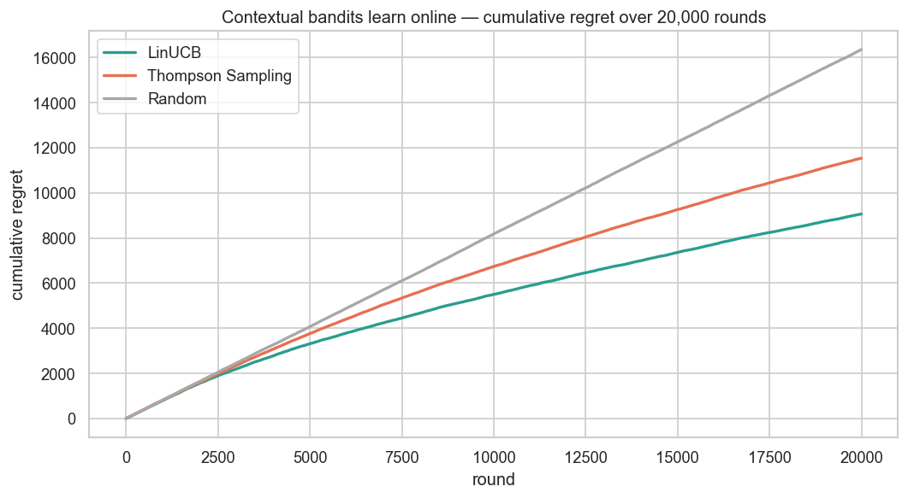
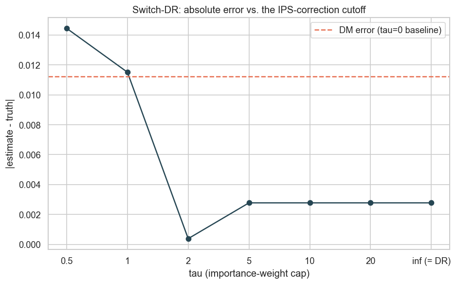

# Recommendation + Off-Policy Evaluation

[](https://www.python.org/)
[](https://numpy.org/)
[](https://scipy.org/)
[](https://scikit-learn.org/)
[](tests/)

Offline metrics tell you which recommender *ranks* best on yesterday's logs.
They do **not** tell you what would happen if you actually deployed it — for
that, teams run slow, risky A/B tests. This project builds an implicit-feedback
recommender on MovieLens-1M and then answers the harder, more valuable question
with **off-policy evaluation (OPE)**: *estimate the online value of a new
recommender from logs the current system already produced, before shipping it.*

OPE is the counterfactual, causal side of recommendation — the same "what would
happen if we intervened differently?" logic as A/B testing, but computed from
observational logs. This is a capability most portfolios never touch.

**Dataset:** MovieLens-1M — 1,000,209 interactions · 6,040 users · 3,706 items ·
4.5% dense · implicit feedback (rating ≥ 4 = positive)
**Recommender:** implicit ALS (Hu-Koren-Volinsky) from scratch — beats the
popularity baseline on **every** ranking metric (NDCG@10 0.089 vs 0.078) and on
**coverage** by 14× (34% vs 2%)
**OPE:** IPS · SNIPS · Direct Method · Doubly Robust · Switch-DR, from scratch,
validated against known ground truth — DR gives the lowest RMSE and correctly
selects the policy worth shipping
**Bandits:** LinUCB and linear Thompson Sampling, from scratch, learning a
recommender policy online — LinUCB cuts average regret from 0.69 to 0.33 over
20k rounds and ends with 45% less cumulative regret than random exploration
**Stack:** Python 3.11 · NumPy · SciPy · scikit-learn (no black-box recsys/OPE/bandit library)

---

## Why this project

1. **Recommendation is a different problem shape** from classification —
   implicit feedback, ranking metrics (NDCG/MAP/coverage), and a leakage-free
   **temporal** split.
2. **Off-policy evaluation is the senior differentiator.** Deciding *which
   policy to deploy* from logged data — with the bias/variance trade-offs of
   IPS vs DM vs Doubly Robust vs Switch-DR — is a genuinely advanced,
   rarely-seen skill.
3. **Online learning closes the loop.** Contextual bandits (LinUCB, linear
   Thompson Sampling) show the other half of the story: not just evaluating a
   fixed policy from logs, but learning one directly, with regret quantifying
   the real cost of exploration along the way.
4. Everything is **implemented from scratch** (iALS, ranking metrics, all five
   OPE estimators, both bandits) and **unit-tested**, including a test that IPS
   is unbiased, DR recovers ground truth, and LinUCB/Thompson Sampling beat
   random exploration on a controlled simulation.

---

## Project Structure

```
recsys-off-policy-eval/
├── src/
│   ├── data/load.py               # MovieLens loader + leakage-free temporal split
│   ├── recommenders/
│   │   ├── popularity.py          # non-personalised baseline
│   │   └── ials.py                # implicit ALS matrix factorisation (from scratch)
│   ├── evaluation/ranking.py      # Recall/Precision/MAP/NDCG@k + coverage
│   └── ope/
│       ├── estimators.py          # IPS, SNIPS, DM, DR, Switch-DR + logged-bandit simulation
│       └── bandits.py             # LinUCB, linear Thompson Sampling + online regret harness
├── notebooks/
│   ├── 01_eda.ipynb               # sparsity, long-tail, temporal-split validation
│   ├── 02_recommenders.ipynb      # popularity vs iALS on ranking metrics
│   ├── 03_off_policy_eval.ipynb   # IPS/SNIPS/DM/DR vs ground truth (bias/variance)
│   ├── 04_policy_comparison.ipynb # use OPE to choose which recommender to ship
│   └── 05_contextual_bandits.ipynb # LinUCB/Thompson regret curves + Switch-DR tau sweep
├── tests/                         # 22 tests: ranking correctness, OPE unbiasedness, iALS, bandits
├── data/raw/                      # MovieLens-1M (not committed)
├── reports/figures/
└── pyproject.toml
```

---

## Results

### 1. iALS beats the popularity baseline on every metric

Evaluated on the temporal test split (each user's most recent 20% held out):

| Metric | Popularity | iALS | Uplift |
|--------|-----------|------|--------|
| Recall@10 | 0.078 | **0.097** | +25% |
| Precision@10 | 0.069 | **0.072** | +4% |
| MAP@10 | 0.037 | **0.039** | +8% |
| NDCG@10 | 0.078 | **0.089** | +14% |
| **Coverage** | 0.024 | **0.338** | **+14×** |

Popularity recommends only ~2% of the catalogue (blockbusters); iALS surfaces
34% of it while ranking better — the difference between a bestseller list and a
recommender.


### 2. Off-policy evaluation recovers the truth

A controlled bandit simulation (context = user, actions = top-200 items,
reward = the user genuinely likes the item) lets us compare each estimator
against the **known** true policy value. Logging policy = exploratory
popularity; target policy = sharp iALS.

**Ground truth:** V(logging) = 0.196, V(target) = **0.414** — the new
recommender would lift reward **+111%**. All four estimators, using logs only,
recover this:

| Estimator | Estimate | Bias | Std | RMSE |
|-----------|----------|------|-----|------|
| IPS | 0.415 | +0.002 | 0.012 | 0.012 |
| SNIPS | 0.417 | +0.003 | 0.009 | 0.010 |
| Direct Method | 0.420 | +0.007 | 0.008 | 0.010 |
| **Doubly Robust** | 0.417 | +0.004 | 0.009 | **0.009** |

The textbook bias/variance pattern is clear: **IPS** is (near-)unbiased but
highest-variance; **DM** is lowest-variance but most biased; **Doubly Robust**
gives the best RMSE by hedging — it is unbiased if *either* the propensities or
the reward model are correct.


### 3. OPE picks the right policy to ship

Scoring three candidate recommenders with DR-OPE from the status-quo logs
selects the **same winner as the ground truth** — without any A/B test.


That is the business payoff: turn existing logs into a deployment decision
instead of spending weeks of live traffic (and exposing users to worse
candidates) to learn the same thing.

### 4. Contextual bandits learn a policy online — and Switch-DR evaluates it

OPE above evaluates a *fixed* candidate policy from logs. Notebook 05 asks the
complementary question: what if the recommender learns online instead, and how
much does exploration cost along the way?

LinUCB and linear Thompson Sampling each learn a per-item ridge-regression
reward model from scratch, one user interaction at a time, over 20,000 rounds
against the same 200 candidate items:

| Policy | Avg. regret (first 20%) | Avg. regret (last 20%) | Cumulative regret |
|--------|--------------------------|--------------------------|--------------------|
| Random | 0.816 | 0.819 | 16,349 |
| Thompson Sampling | 0.768 | 0.447 | 11,536 |
| **LinUCB** | 0.693 | **0.334** | **9,061** |



Both bandits pull ahead of random within the first few thousand rounds and the
gap widens as they learn — LinUCB ends **45% lower** cumulative regret than
random exploration.

Converting LinUCB's learned policy back into something OPE can score and
sweeping Switch-DR's importance-weight cap `tau` shows the estimator is a real
bias/variance dial, not a strictly-better version of DR: error is **lowest at
tau=2** (0.0004), not at tau=∞ (0.0028, = plain DR) or tau=0 (0.0113, = DM).



---

## Quickstart

```bash
# 1. install
pip install -e ".[dev]"

# 2. download MovieLens-1M into data/raw/
curl -L -o /tmp/ml-1m.zip https://files.grouplens.org/datasets/movielens/ml-1m.zip
unzip -o /tmp/ml-1m.zip -d /tmp && cp /tmp/ml-1m/ratings.dat data/raw/ratings.dat

# 3. run the notebooks in order (01 → 05)

# 4. run the tests
python -m pytest tests/ -v
```

---

## Technical Notes

- **Leakage-free evaluation:** temporal split (hold out each user's most recent
  interactions), verified in notebook 01 — no user's test items predate their
  training items.
- **iALS from scratch:** the Hu-Koren-Volinsky confidence-weighted ALS with the
  efficient per-user normal-equation solve (one precomputed `YᵀY` per sweep).
- **Overlap matters:** the OPE policies use ε-mixing so every action keeps
  positive probability; the effective sample size (ESS) is reported as a
  diagnostic for when IPS/DR can be trusted.
- **Honest simulation:** the reward model behind DM/DR is a logistic regression
  fit on logged data only — DR is *not* handed the oracle, so the reported
  small DM bias is real, not an artefact.
- **Bandit context is deliberately low-dimensional:** the online bandits use an
  8-factor iALS embedding (not the 64-factor one behind the offline
  recommender) — a real sample-efficiency trade-off given only 20k rounds
  spread across 200 arms.
- **Sherman-Morrison updates:** both `LinUCB` and `LinearThompsonSampling`
  maintain each arm's `A_a^{-1}` via a rank-1 update instead of re-inverting a
  (d×d) matrix every round.

---

## Caveats

OPE is trustworthy only where the logging policy explores the actions the target
policy favours (adequate overlap / ESS). A near-deterministic logging policy
breaks IPS/DR. Any shortlisted policy should still get a final confirmatory A/B
test before full rollout — OPE narrows the field cheaply; it does not replace
the last mile of validation.
